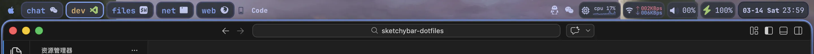

# sketchybar-dotfiles

个人 SketchyBar 配置仓库，用于自定义 macOS 菜单栏布局和信息显示。

## 效果展示



## 使用方法

`install_sketchybar.sh` 仅负责依赖安装（Homebrew 包、字体、SbarLua），不处理配置文件链接、bar 启动和旧配置备份。

1. 克隆本仓库

```bash
git clone https://github.com/milk2715093695/sketchybar-dotfiles.git
```

2. 备份原有配置

```bash
mv ~/.config/sketchybar ~/.config/sketchybar.bak
```

3. 创建符号链接

```bash
ln -s ~/sketchybar-dotfiles ~/.config/sketchybar
```

4. 运行安装脚本

```bash
cd ~/sketchybar-dotfiles
chmod +x install_sketchybar.sh
./install_sketchybar.sh
```

## 注意

* 本仓库仅为个人配置
* 部分 widget 依赖 macOS 命令行工具或 C 编译的事件提供器
* 使用前建议先备份原有配置

## 致谢

本仓库基于以下项目进行修改和整理：

https://github.com/FelixKratz/dotfiles

感谢原作者的工作。

## 许可证

原项目使用 **GNU General Public License v3.0 (GPLv3)** 许可证发布。
由于本仓库基于该项目进行修改，根据 GPLv3 的要求，本仓库同样以 **GPLv3** 许可证发布。

有关许可证的完整内容，请参阅仓库中的 [LICENSE](./LICENSE) 文件。
